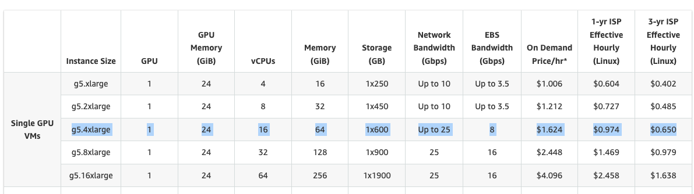

<div align="left">

  
  # Financial-Intent-Understanding-with-LLMs

  使用LlamaFactory微调大语言模型｜评测开源金融评测数据集【金融意图理解】

  <a href="#-项目介绍">项目介绍 </a> •
  <a href="#-亮点">亮点 </a> •
  <a href="#-数据集内容">数据集内容 </a> •
  <a href="#-使用指南">使用指南 </a> •
  <a href="#-硬件说明">硬件说明 </a> •
  <a href="#-备注"> 备注 </a> •

  <br />
  <br />

  简体中文 | [English](README_EN.md)

</div>


## 项目介绍
本项目使用LlamaFactory微调大语言模型，评测开源金融评测数据集【金融意图理解】。目前主要使用ChatGLM3-6B, Qwen2.5-7B-Instruct, Baichuan2-7B-Chat, Llama-3-8B-Instruct模型，利用LlamaFactory进行LoRA微调,并对金融意图理解任务进行评测和对比。
旨在展示如何利用LlamaFactory微调大语言模型的过程（包括数据集准备、模型选择、LoRA微调、评测和对比）。

## 亮点

- **实操性**: 模拟实际工作流程，从数据集准备、模型选择、LoRA微调、评测和对比，完整展示利用LlamaFactory对大语言模型进行（LoRA）微调的全过程。
- **数据准备**: 作为demo，从开源金融评测集[OpenFinData](https://github.com/open-compass/OpenFinData/releases/download/release/openfindata_release.zip)数据集中选取一个子集【金融意图理解】，该数据集代表了最真实的产业场景需求，是真实的，专业性的金融评测数据集。对于微调数据集，我们使用Claude3.5-sonnet-20241022按照评测集数据格式进行数据生成（500条训练数据，160条验证数据），并按照Alpaca数据集格式进行整理,上传到HuggingFace [Datasets](https://huggingface.co/datasets/klaylouis1932/OpenFinData-Intent-Understanding-Intruct)。
- **模型选择**: 使用ChatGLM3-6B, Qwen2.5-7B-Instruct, Baichuan2-7B-Chat, Llama-3-8B-Instruct模型，利用LlamaFactory进行LoRA微调。
- **评测和对比**:通过对金融意图理解评测集进行评测和对比，展示不同模型的性能。


## 数据集内容


OpenFinData数据集【金融意图理解】的[数据](https://huggingface.co/datasets/klaylouis1932/OpenFinData-Intent-Understanding)格式：


处理后[数据]格式(https://huggingface.co/datasets/klaylouis1932/OpenFinData-Intent-Understanding-Intruct)（Alpaca格式）：


## 使用指南

1. **安装LlamaFactory**: 
```
git clone --depth 1 https://github.com/hiyouga/LLaMA-Factory.git
cd LLaMA-Factory
pip install -e ".[torch,metrics]"
```
2. **更新data/dataset_info.json使用您的自定义数据集**
以本demo为例，自定义数据（alpaca格式）以Online的形式存储在HuggingFace Datasets上, 因此只需要在data/dataset_info.json中添加:
```
"intent_understanding": {
    "hf_hub_url": "klaylouis1932/OpenFinData-Intent-Understanding-Intruct"
  },
```
  即可。
  如果是本地数据集，则需要将数据集（json文件）上传到data文件夹，并在data/dataset_info.json中添加，参考alpaca_en_demo.json:
  ```
  "alpaca_en_demo": {
    "file_name": "alpaca_en_demo.json"
  },
  ```
3. **更新配置文件**
本demo使用LoRA微调，因此需要更新LlamaFactory在examples文件下给的配置文件，以ChatGLM3-6B为例，更新如下：
```
train_lora/chatglm3_lora_sft.yaml
merge_lora/chatglm3_lora_sft.yaml
inference_lora/chatglm3_lora_sft.yaml
```
其他模型配置文件类似，只需要更新模型名称和数据集名称即可。
你可以参考本demo中在config文件夹下提供的配置文件，进行修改，然后放到examples文件夹对应的文件夹下。

## 硬件说明
本项目使用AWS EC2 ml.g5.4xlarge实例，单卡训练，训练时间10分钟（500-600条数据，7B模型）。GPU为A10G，显存为24GB。


## 备注

本项目仅展示如何利用LlamaFactory对大语言模型进行LoRA微调，微调数据集1K以内，模型选择主要以7B为主，单卡训练。


