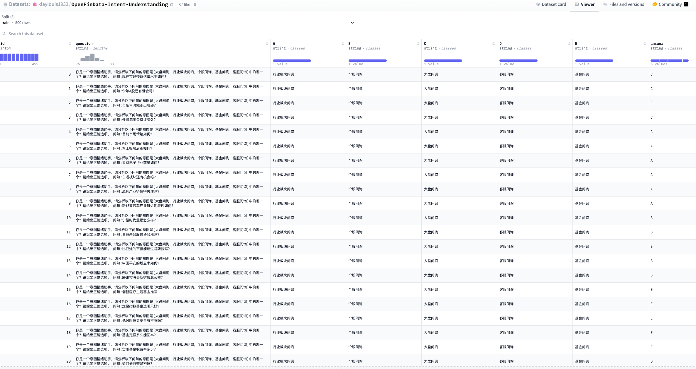
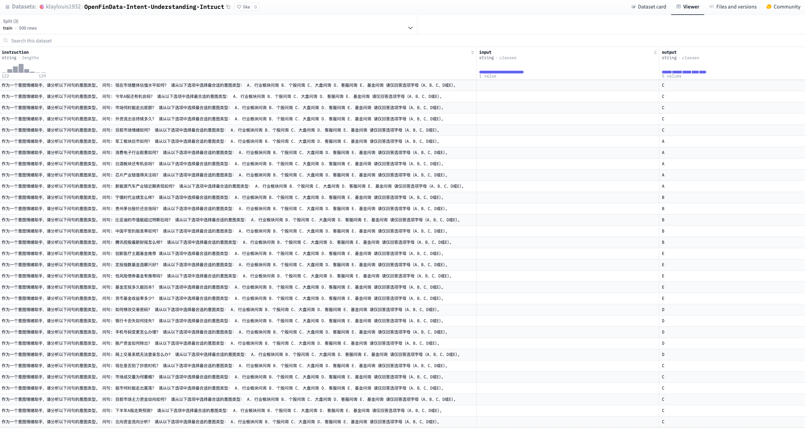

# 🎯 Financial-Intent-Understanding-with-LLMs

<div align="left">

使用LlamaFactory微调大语言模型｜评测开源金融评测数据集【金融意图理解】

[](https://www.python.org/downloads/release/python-380/)
[](https://opensource.org/licenses/Apache-2.0)
[](https://github.com/hiyouga/LLaMA-Factory)

<p align="center">
  <a href="#-项目介绍">项目介绍</a> •
  <a href="#-快速开始">快速开始</a> •
  <a href="#-数据集内容">数据集内容</a> •
  <a href="#-如何使用">如何使用</a> •
  <a href="#-实验结果">实验结果</a> •
  <a href="#-常见问题">常见问题</a>
  <a href="#-项目结构">项目结构</a>
  <a href="#-相关资源">相关资源</a>
</p>

简体中文 | [English](README_EN.md)

</div>

## 📖 项目介绍

本项目展示了如何利用LlamaFactory对大语言模型进行微调以解决金融领域的特定任务。我们选取了开源金融评测数据集[OpenFinData](https://github.com/open-compass/OpenFinData)中的金融意图理解任务作为示例,探索了主流开源大模型在该任务上的表现。

### 🎯 项目目标
- 提供一个完整的LLM微调实践案例
- 评估主流开源模型在金融意图理解任务上的能力
- 探索LoRA微调对模型性能的提升效果
- 为金融领域LLM应用提供参考

### 🔍 核心内容

1. **数据集准备**
   - 评测数据集: 使用[OpenFinData](https://github.com/open-compass/OpenFinData)金融意图理解子集
   - 训练数据集: 使用Claude3.5-sonnet生成的500条训练数据和160条验证数据。数据格式遵循Alpaca格式,已上传至[HuggingFace](https://huggingface.co/datasets/klaylouis1932/OpenFinData-Intent-Understanding-Intruct)

2. **模型选择**
   - ChatGLM3-6B: 智谱AI开源的中文对话模型
   - Qwen2.5-7B-Instruct: 阿里云开源的通用大模型
   - Baichuan2-7B-Chat: 百川智能开源的对话模型
   - Llama-3-8B-Instruct: Meta发布的开源模型

## 🚀 快速开始

```bash
# 1. 克隆项目
git clone https://github.com/yourusername/Financial-Intent-Understanding-with-LLMs.git
cd Financial-Intent-Understanding-with-LLMs

# 2. 安装LlamaFactory
git clone --depth 1 https://github.com/hiyouga/LLaMA-Factory.git
cd LLaMA-Factory
pip install -e ".[torch,metrics]"
cd ..

# 3. 准备数据集
# 在data/dataset_info.json中添加，例如：
{
  "intent_understanding": {
    "hf_hub_url": "klaylouis1932/OpenFinData-Intent-Understanding-Intruct"
  }
}

# 4. 开始训练(以Qwen为例)
!llama_factory train config/qwen25/qwen25_7b_lora_sft.yaml

# 5. 导出模型(以Qwen为例)
!llama_factory export config/qwen25/qwen25_7b_lora_sft_export.yaml

# 6. 模型推理
!llama_factory inference config/qwen25/qwen25_7b_lora_sft_inference.yaml
```

## 📊 数据集内容

<details>
<summary>点击展开数据集详情</summary>

### 原始数据格式
    {
        "id": "0",
        "question": "你是一个意图情绪助手。请分析以下问句的意图是[大盘问询，行业板块问询，个股问询，基金问询，客服问询]中的哪一个？请给出正确选项。\n问句:商业银行可以吗",
        "A": "行业板块问询",
        "B": "个股问询",
        "C": "大盘问询",
        "D": "客服问询",
        "E": "基金问询",
        "answer": "A"
    }


### 处理后数据格式
`instruction`:
作为一个意图情绪助手，请分析以下问句的意图类型。

问句: 商业银行可以吗

请从以下选项中选择最合适的意图类型：
A. 行业板块问询
B. 个股问询
C. 大盘问询
D. 客服问询
E. 基金问询

请仅回答选项字母（A、B、C、D或E）。

 `input`: ""
 
 `output`: A


</details>


## 📈 实验结果

### 模型性能对比

| 模型 | 基准准确率 | 微调后准确率 | 提升幅度 |
|-------|------------|--------------|-----------|
| Qwen-7B | 85.33% | 88.00% | +2.67% |
| Baichuan2-7B | 70.67% | 88.00% | +17.33% |
| Llama-3-8B | 74.67% | 86.67% | +12.00% |
| ChatGLM3-6B | 49.33% | 85.33% | +36.00% |

### 关键发现
- 所有模型经过LoRA微调后都取得显著提升
- Qwen-7B基准性能最好,显示出优秀的零样本能力
- ChatGLM3-6B提升最为显著(+36%)
- 微调后各模型性能趋于接近,都达到85%以上的准确率
- Claude-3.5在相同任务上获得94.67%的准确率(无微调)

## 💻 硬件要求
- AWS EC2 ml.g5.4xlarge实例
- GPU: A10G (24GB显存)
- 训练时间: 约10分钟(单卡训练500-600条数据)

## ❓ 常见问题

<details>
<summary>1. 如何处理显存不足问题？</summary>

- 减小batch_size
- 增加gradient_accumulation_steps
- 使用bf16训练
- 启用8-bit量化训练
- 减少cutoff_length
</details>


## 📚 项目结构
```
├── config/                     # 配置文件
│   ├── qwen25/                  # Qwen模型配置
│   ├── chatglm3/             # ChatGLM3模型配置
│   ├── baichuan2/             # Baichuan模型配置
│   └── llama3/               # Llama3模型配置
├── data/                      # 数据集相关
│   └── dataset_info.json     # 数据集配置
├── evaluation/               # 评测结果
├── README.md                 # 项目说明文档
```


## 📜 许可证

本项目采用 [Apache 2.0](LICENSE) 许可证。

## 🔗 相关资源

- [LlamaFactory](https://github.com/hiyouga/LLaMA-Factory)
- [OpenFinData数据集](https://github.com/open-compass/OpenFinData)
- [Alpaca数据格式](https://github.com/tatsu-lab/stanford_alpaca)
