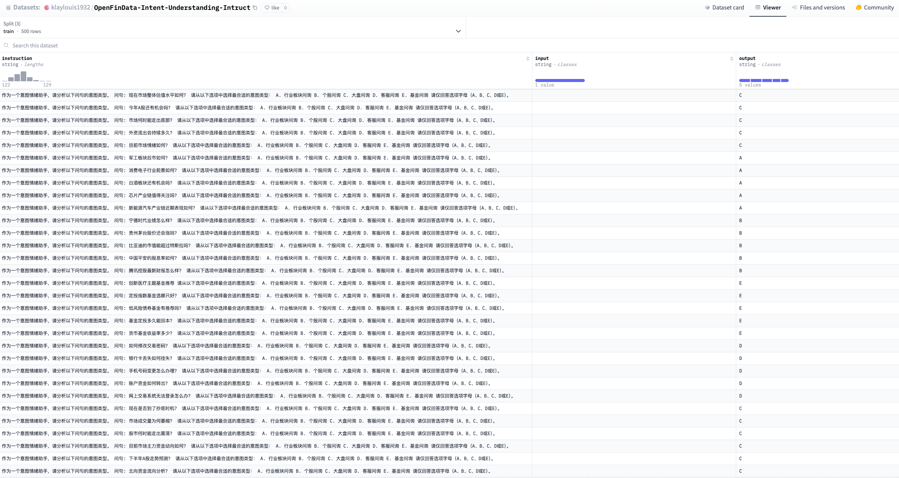

# 🎯 Financial-Intent-Understanding-with-LLMs

<div align="left">

Fine-tuning LLMs using LlamaFactory | Evaluating Open-source Financial Datasets【Financial Intent Understanding】

[](https://www.python.org/downloads/release/python-380/)
[](https://opensource.org/licenses/Apache-2.0)
[](https://github.com/hiyouga/LLaMA-Factory)

<p align="center">
  <a href="#-project-introduction">Project Introduction</a> •
  <a href="#-quick-start">Quick Start</a> •
  <a href="#-dataset-content">Dataset Content</a> •
  <a href="#-how-to-use">How to Use</a> •
  <a href="#-experimental-results">Experimental Results</a> •
  <a href="#-faq">FAQ</a>
  <a href="#-project-structure">Project Structure</a>
  <a href="#-related-resources">Related Resources</a>
</p>

[简体中文](README.md) | English

</div>

## 📖 Project Introduction

This project demonstrates how to fine-tune large language models using LlamaFactory for specific financial domain tasks. We selected the financial intent understanding task from the open-source financial evaluation dataset [OpenFinData](https://github.com/open-compass/OpenFinData) as an example to explore the performance of mainstream open-source large models.

### 🎯 Project Goals
- Provide a complete LLM fine-tuning practice case
- Evaluate mainstream open-source models' capabilities in financial intent understanding
- Explore the performance improvement through LoRA fine-tuning
- Provide reference for LLM applications in the financial domain

### 🔍 Core Content

1. **Dataset Preparation**
   - Evaluation Dataset: Using [OpenFinData](https://github.com/open-compass/OpenFinData) financial intent understanding subset
   - Training Dataset: 500 training samples and 160 validation samples generated by Claude3.5-sonnet. Following Alpaca format, uploaded to [HuggingFace](https://huggingface.co/datasets/klaylouis1932/OpenFinData-Intent-Understanding-Intruct)

2. **Model Selection**
   - ChatGLM3-6B: Open-source Chinese dialogue model by Zhipu AI
   - Qwen2.5-7B-Instruct: General-purpose model by Alibaba Cloud
   - Baichuan2-7B-Chat: Dialogue model by Baichuan Intelligence
   - Llama-3-8B-Instruct: Open-source model by Meta

## 🚀 Quick Start

```bash
# 1. Clone the project
git clone https://github.com/yourusername/Financial-Intent-Understanding-with-LLMs.git
cd Financial-Intent-Understanding-with-LLMs

# 2. Install LlamaFactory
git clone --depth 1 https://github.com/hiyouga/LLaMA-Factory.git
cd LLaMA-Factory
pip install -e ".[torch,metrics]"
cd ..

# 3. Prepare dataset
# Add to data/dataset_info.json, example:
{
  "intent_understanding": {
    "hf_hub_url": "klaylouis1932/OpenFinData-Intent-Understanding-Intruct"
  }
}

# 4. Start training (using Qwen as example)
!llama_factory train config/qwen25/qwen25_7b_lora_sft.yaml

# 5. Export model (using Qwen as example)
!llama_factory export config/qwen25/qwen25_7b_lora_sft_export.yaml

# 6. Model inference
!llama_factory inference config/qwen25/qwen25_7b_lora_sft_inference.yaml
```

## 📊 Dataset Content

<details>
<summary>Click to expand dataset details</summary>

### Original Data Format
    {
        "id": "0",
        "question": "You are an intent and emotion assistant. Please analyze which of the following intents [Market Inquiry, Industry Sector Inquiry, Individual Stock Inquiry, Fund Inquiry, Customer Service Inquiry] does this question belong to? Please provide the correct option.\nQuestion: How about commercial banks?",
        "A": "Industry Sector Inquiry",
        "B": "Individual Stock Inquiry",
        "C": "Market Inquiry",
        "D": "Customer Service Inquiry",
        "E": "Fund Inquiry",
        "answer": "A"
    }


### Processed Data Format
`instruction`:
As an intent and emotion assistant, please analyze the intent type of the following question.

Question: How about commercial banks?

Please choose the most appropriate intent type from the following options:
A. Industry Sector Inquiry
B. Individual Stock Inquiry
C. Market Inquiry
D. Customer Service Inquiry
E. Fund Inquiry

Please only answer with the option letter (A, B, C, D, or E).

 `input`: ""
 
 `output`: A


</details>

## 📈 Experimental Results

### Model Performance Comparison

| Model | Base Accuracy | Fine-tuned Accuracy | Improvement |
|-------|--------------|---------------------|-------------|
| Qwen2.5-7B-Instruct | 85.33% | 88.00% | +2.67% |
| Baichuan2-7B-Chat | 70.67% | 88.00% | +17.33% |
| Llama-3-8B-Instruct | 74.67% | 86.67% | +12.00% |
| ChatGLM3-6B | 49.33% | 85.33% | +36.00% |

### Key Findings
- All models showed significant improvement after LoRA fine-tuning
- Qwen2.5-7B-Instruct showed best baseline performance, demonstrating excellent zero-shot capability
- ChatGLM3-6B showed the most significant improvement (+36%)
- After fine-tuning, all models' performance converged to above 85% accuracy
- Claude-3.5 Sonnet achieved 94.67% accuracy on the same task (without fine-tuning)

## 💻 Hardware Requirements
- AWS EC2 ml.g5.4xlarge instance
- GPU: A10G (24GB VRAM)
- Training time: About 10 minutes (single GPU training 500-600 samples)

## ❓ FAQ

<details>
<summary>1. How to handle out-of-memory issues?</summary>

- Reduce batch_size
- Increase gradient_accumulation_steps
- Use bf16 training
- Enable 8-bit quantization training
- Reduce cutoff_length
</details>

## 📚 Project Structure
```
├── config/                     # Configuration files
│   ├── qwen25/                  # Qwen model configs
│   ├── chatglm3/             # ChatGLM3 model configs
│   ├── baichuan2/             # Baichuan model configs
│   └── llama3/               # Llama3 model configs
├── data/                      # Dataset related
│   └── dataset_info.json     # Dataset configuration
├── evaluation/
│   └── notebooks/           # Notebooks for evaluation
│   └── results/             # Evaluation results
├── README.md                 # Project documentation
├── README_EN.md             # Project documentation (English)
```

## 📜 License

This project is licensed under the [Apache 2.0](LICENSE) License.

## 🔗 Related Resources

- [LlamaFactory](https://github.com/hiyouga/LLaMA-Factory)
- [OpenFinData Dataset](https://github.com/open-compass/OpenFinData)
- [Alpaca Data Format](https://github.com/tatsu-lab/stanford_alpaca)
